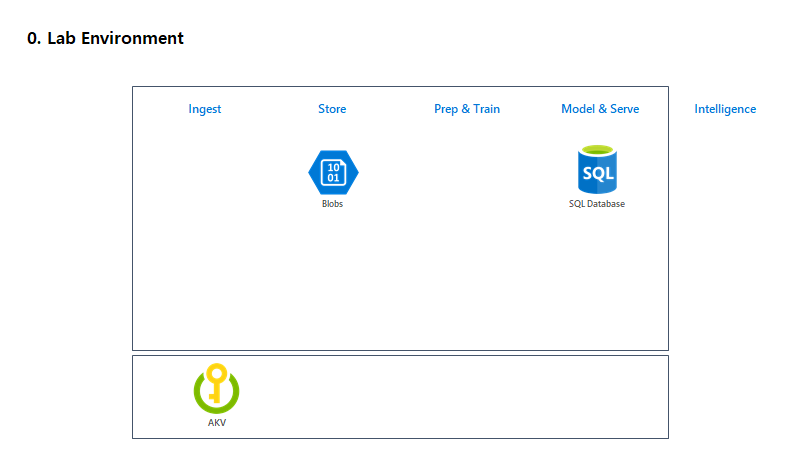
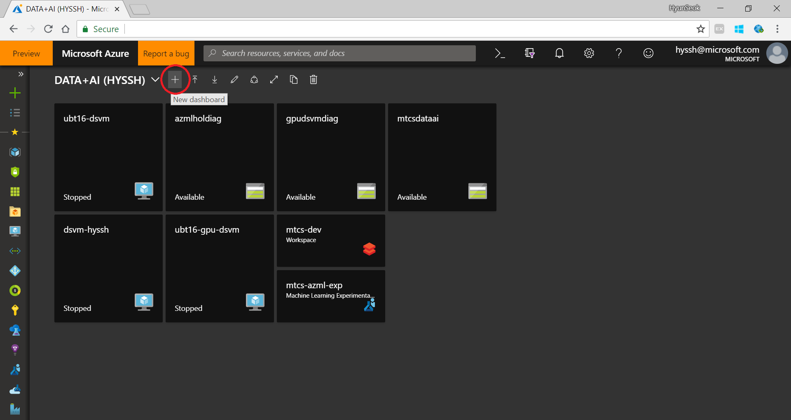
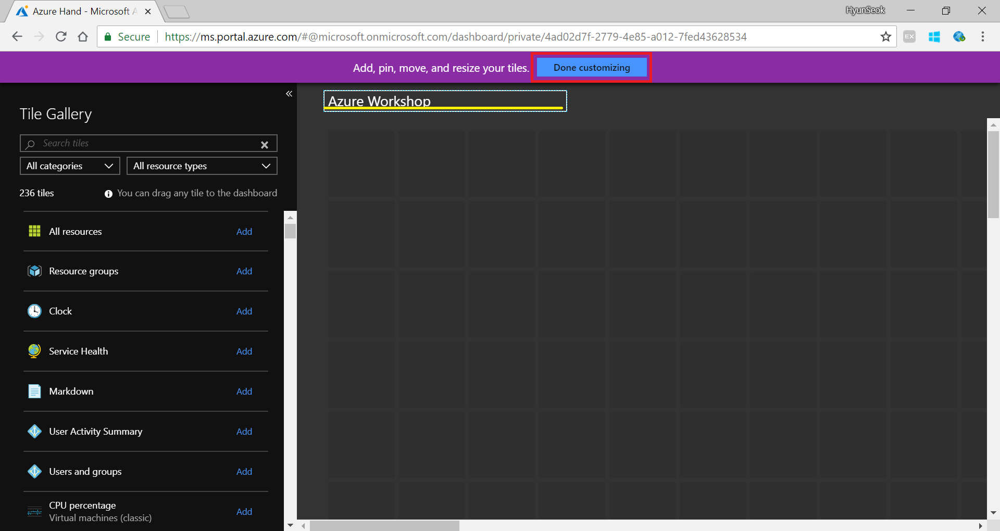
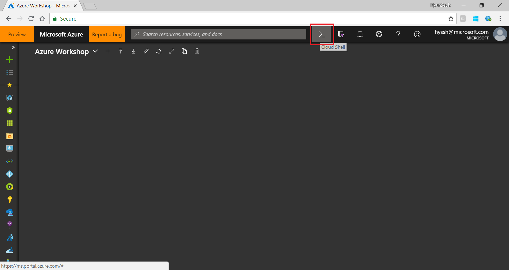
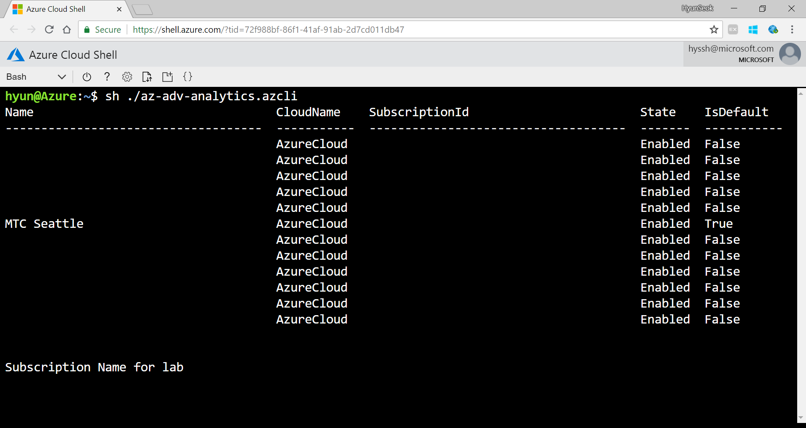
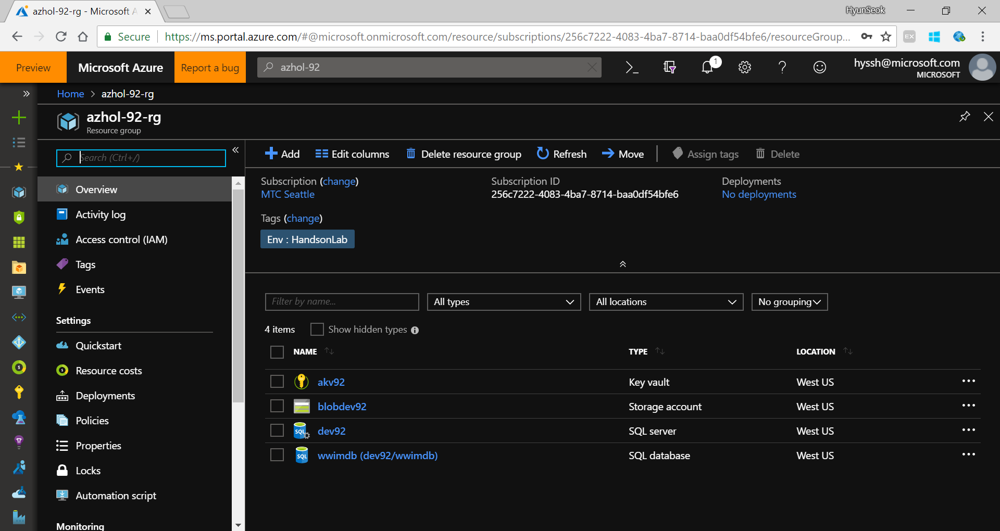

# Lab 00. Create hands on lab environment

## Architecture

Using Azure Cloud Shell and Azure Cli script you can create a lab environment fast and easy. In this lab, use Azure Cli script to set up Hands-on Lab environment.



## 1. Create Hands-on Lab envrironment using a script

1. Open browser and go to [Azure Portal](https://portal.azure.com)

1. __Click__ on _new Dashboard_

    

1. __Type__ name of the dashboard as _Azure Workshop_

    

1. Open cloud shell from the browser

    

1. Download a script

    Run following commnad from the cloud shell prompt

    > Please copy below command and past it to cloud shell prompt

    ```
    wget -O azhollab.azcli https://raw.githubusercontent.com/xlegend1024/az-cloudscale-adv-analytics/master/script/00.CreateLabEnv.azcli
    ```

1. Run command to create a resource group and resource

    > Care with subscription name when you run the script

    ```bash
    sh ./azhollab.azcli
    ```

    

    Make sure you use correct __Azure Subscription__ for the Hands-on lab.

1. Make sure you have a resource group and Azure Key Vault, Blob, SQLDB in the resource group

    

    If you have 4 services in your resource group you can proceed next step.

---
[Next > 01. Ingest Data](https://github.com/xlegend1024/az-cloudscale-adv-analytics/blob/master/01Ingest.md)

---
[Main](https://github.com/xlegend1024/az-cloudscale-adv-analytics/blob/master/README.md)
