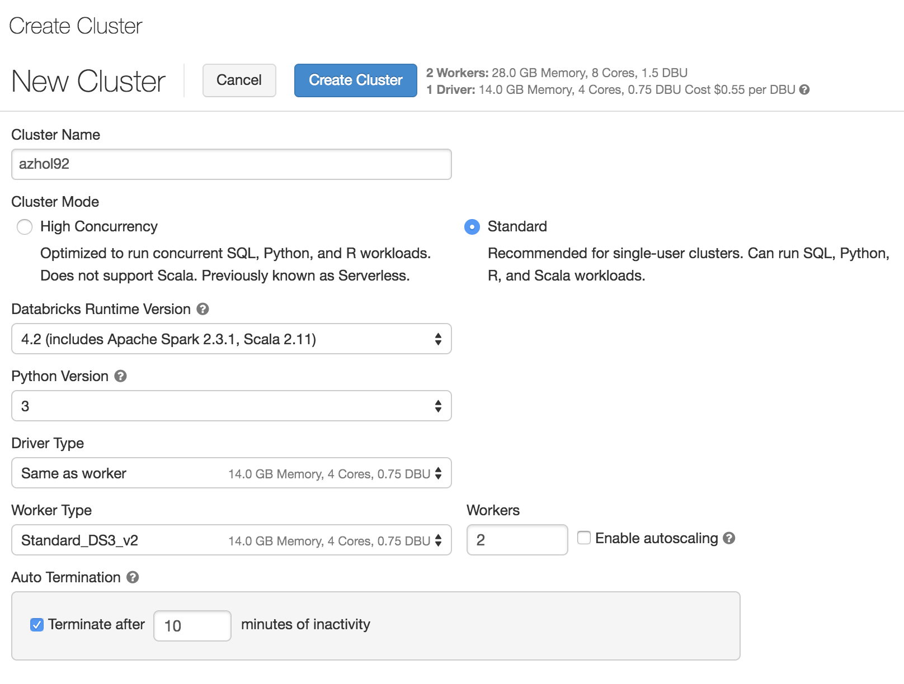
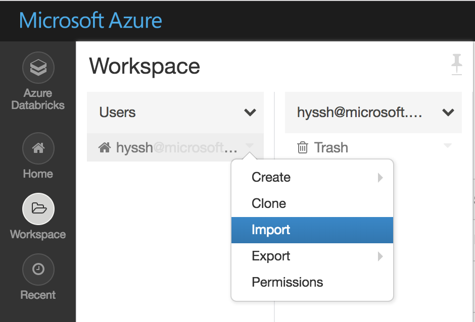
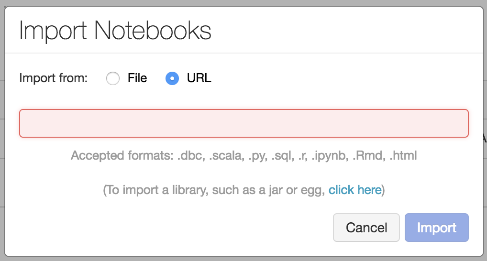
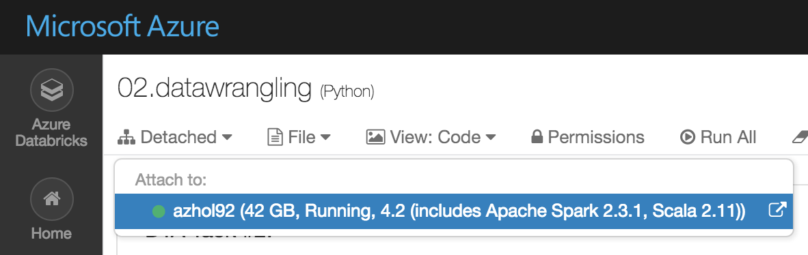

# 02. Data Wrangling

## Architecture

In this lab, we'll use Databricks to wrangle data in the blob storage
Before you follow the steps, please make sure concept of ADF

* Mount the blob storage to Databricks 
* Python
* Dataframe

## 1. Create Azure Databricks

Create a service from here [Azure Portal #Create Azure Databricks](https://ms.portal.azure.com/#create/Microsoft.Databricks) to create Azure Databricks

__Type__ Azure Databricks workspace name, e.g.) azhol92

__Select__ appropreate Azure subscription

__Select__ 'Use Existing' and find your hands-on lab resource group name from the drop box e.g.) azhol-92-rg

__Select__ 'West US' for location

__Select__ 'Premium (+Role-based access controls)' for Pricing Tier

> __Pin__ Azure Databricks on your Azure Portal dashboard

## 2. Create Azure Databricks cluster (10 mins)

__Open__ your Azure Databricks workspace or open [Azure Databricks](https://westus.azuredatabricks.net/) from your browser

__Click__ 'Cluster' icon on the left panel of screen

__Click__ '+ Create Cluster' and fill out the form like following

|Name|Value|
|---|---|
|Cluster Name|azhol92|
|Cluster Mode|Standard Mode|
|Databricks Runtime Ver.|4.2.|
|Python Ver.|3|
|Driver Type|same as worker|
|Worker Type|Standard DS3 v2|
|Workers|2|
|Enable autoscaling|Uncheck|
|Auto Termination|Check, 10|



## 3. Interact with data via Notebook

### 3.1 Import from notebook

__Click__ 'Workspace' on Azure Databricks Portal

__Click__ 'Users', __click__ on little icon next to user name and then __click__ 'Import' to import existing notebook in to your Azure Databricks workspace



__Select__ 'URL', __Copy__ below url and __paste__ it to import window

```html
https://raw.githubusercontent.com/xlegend1024/az-cloudscale-adv-analytics/master/AzureDatabricks/02.datawrangling.ipynb
```



__Click__ 'Import' button, then the notebook will automatically open on your browser

__Click__ 'Detached' menu and then __Select__ your cluster on the list.



### 3.2. Update widget parameters for the lab

Find blob strage account name and key and then update Notebook parameters


### 3.3 Run command from the notebook

Run differen languages (Python, Scala, R, SQL) to load data from blob to Databricks Data wrangling

### 3.4 Save final training dataset to blob

Run the commnad from Notebook on Databricks

### 3.5 (optional) Run Machine Learning in Databricks

Optionaly we can run Machine Learning in Databricks

---
[Next > 03. Modeling](https://github.com/xlegend1024/az-cloudscale-adv-analytics/blob/master/03Modeling.md)

---
[Main](https://github.com/xlegend1024/az-cloudscale-adv-analytics/blob/master/README.md)
