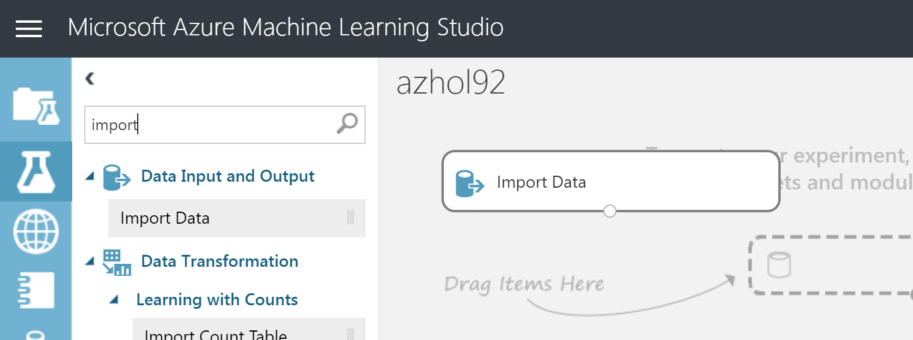

# 03. Modeling

## Architecture

## 1. Create Azure Machine Learning Studio

Create a service from here [Azure Portal #Create ML Studio](https://ms.portal.azure.com/#create/Microsoft.MachineLearningWorkspace) for lab.

Reference following table to create the service

|Name|Value|
|---|---|
|workspace Name|azhol###|
|Subscription|_yoursubscription_|
|Resource Group|azhol-###-rg|
|Localtion|South Central US|
|Storage Account|'Create new' , azhol###storage|
|Workspace pricing tier|Standard|
|Web service plan|'create new', azhol###Plan|

Once you fill out the from, __create__ by clicking button 'Create'

> __Pin__ the service to access the service easy
> 

## 2. Access ML Studio

Open a new browser or tap and go to [Azure ML Studio](https://studio.azureml.net)

__Click__ on sign in, if you are already loged in on Azure Portal, it'll automatically

When you logged in to the service, please make sure your workspace name is correct or not

## 3. Create a new experiment

__Click__ '+ NEW' and __click__ 'Blank Experiment'

### 3.1. Rename experiment

__Click__ on the title of the experiment, and name it as _azhol###_

### 3.2. Imoprt dataset

__Search__ _import_ from the left search box and __drag and drop__ the import module to canvas

### 3.3. Understand data

### 3.4. Split data

### 3.5. Train

### 3.6. Select a Model

---
[Next > 04. Operationalization](https://github.com/xlegend1024/az-cloudscale-adv-analytics/blob/master/04Operationalization.md)

---
[Main](https://github.com/xlegend1024/az-cloudscale-adv-analytics/blob/master/README.md)
