# 03. Modeling (Azure Machine Learning Studio)

## Architecture

After the data preperation on Azure Databricks, it is time to build a machine learning model to prediect customer chrun. In this lab, we'll use Azure Machine Learning Studio for training and modeling.

* Azure Machine Learning Studio
* How to understand data
* Understand traning algorithm
* Traing models and select the best model

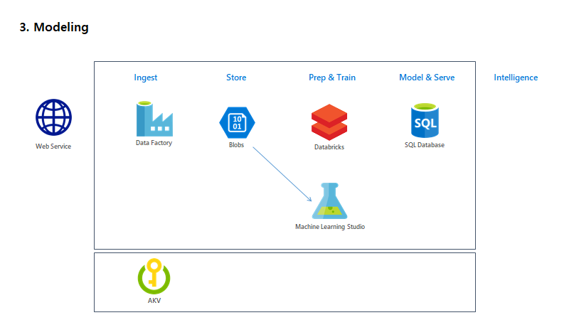

## 1. Create Azure Machine Learning Studio

Create a service from here [Azure Portal #Create ML Studio](https://ms.portal.azure.com/#create/Microsoft.MachineLearningWorkspace) for lab.

Reference following table to create the service

|Name|Value|
|---|---|
|workspace Name|azlab###|
|Subscription|_yoursubscription_|
|Resource Group|azhol-###-rg|
|Localtion|South Central US|
|Storage Account|'Create new' , azhol###storage|
|Workspace pricing tier|Standard|
|Web service plan|'create new', azhol###Plan|

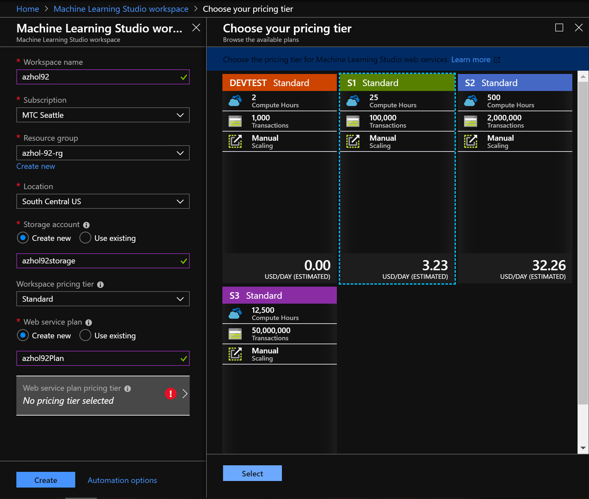

Once you fill out the from, __create__ by clicking button 'Create'

> __Pin__ the service to access the service easy
> 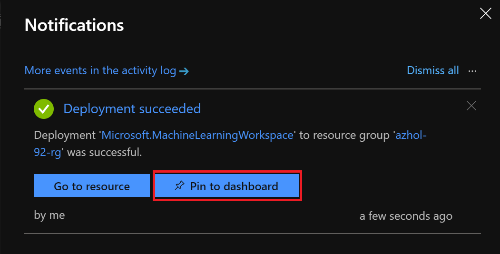

## 2. Access ML Studio

Open a new browser or tap and go to [Azure ML Studio](https://studio.azureml.net)

__Click__ on sign in, if you are already loged in on Azure Portal, it'll automatically

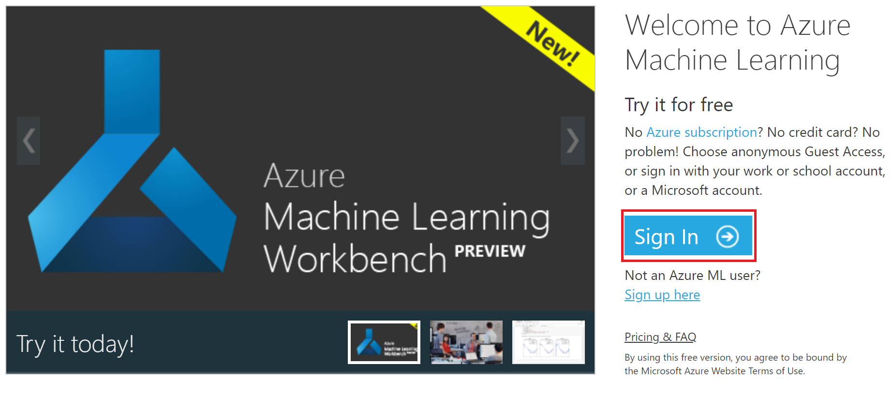

When you logged in to the service, please make sure your workspace name is correct or not

## 3. Create a new experiment

__Click__ '+ NEW' and __click__ 'Blank Experiment'

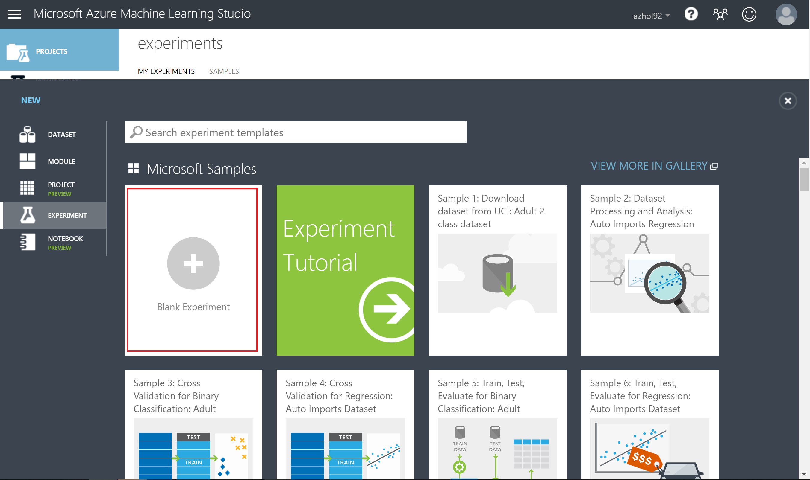

### 3.1. Rename experiment

__Click__ on the title of the experiment, and name it as _azhol###_

### 3.2. Imoprt dataset

3.2.1. Get dataset url

In order to get the dataset url from your blob storage, you need to go to your blob storage account fomr Azure Portal

Open new tab (or browser) go to [Azure Portal](https://portal.azure.com)

Go to you blob by searching name of your blob which is similiar as _'blobdev'_

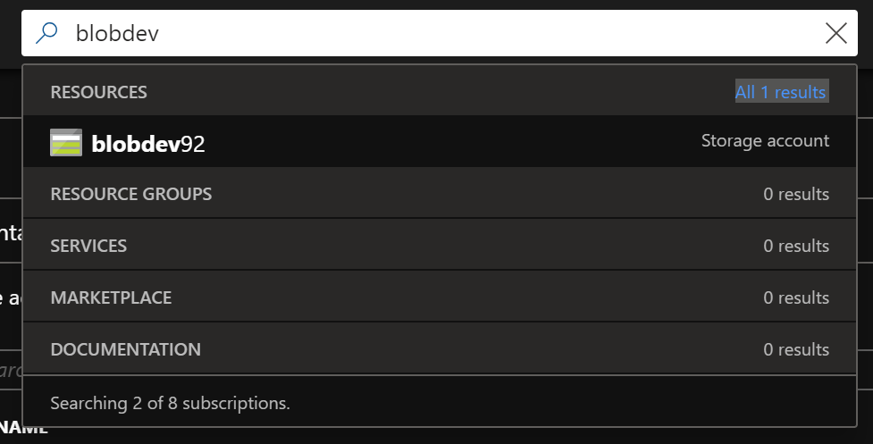

In order to get save url to access to the dataset, you need to create a SAS url from the portal

Go to your blob storage account and go to container _'ingest'_

> Follow menu from the blob blade, _Blob Service > Blobs > inget > azmlstudio_

To generate SAS, click on the file _'part-00000-tid....csv'_, _'Generate SAS'_, _'Generate blob SAS token and URL'_ and then click on _'copy icon'_ at the bottom of the screen

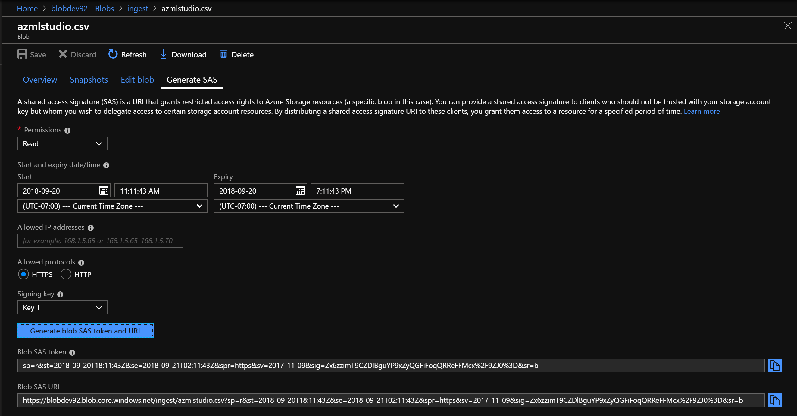

Come back to Azure Machine Learning Studio

__Search__ _import_ from the left search box and __drag and drop__ the import module to canvas

__Click__ on the _'Import Data'_ module

Chage some options in the properties on the left panel

|Name|Value|
|---|---|
|Data Source|Web URL via HTTP|
|Data Source URL|_paste url from the blob SAS generater_|
|Data format|csv|
|CSV or TSV has header|Check|
|Use cached resutls|Check|

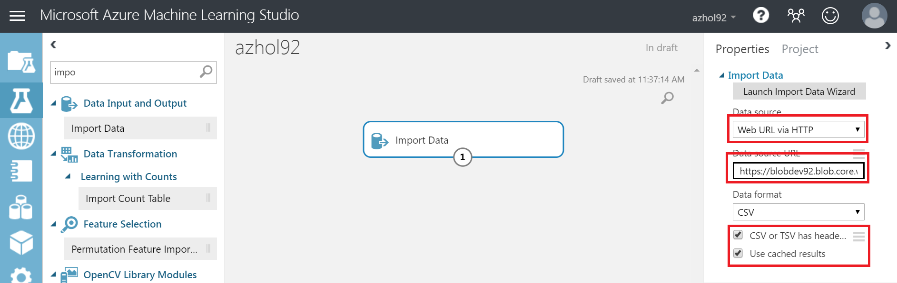

__Click__ _'Run'_ button in the bottom of the canvas, then it will download the dataset from blob to Azure ML Studio in a  minute (around 10 sec)

### 3.3. Understand data

When the running is done, you will see green check mark on your right coner of the canvas

__Right click__ on the port of the module and __click__ on _'Visualize'_

From the visualize you can see summary informatio about the dataset

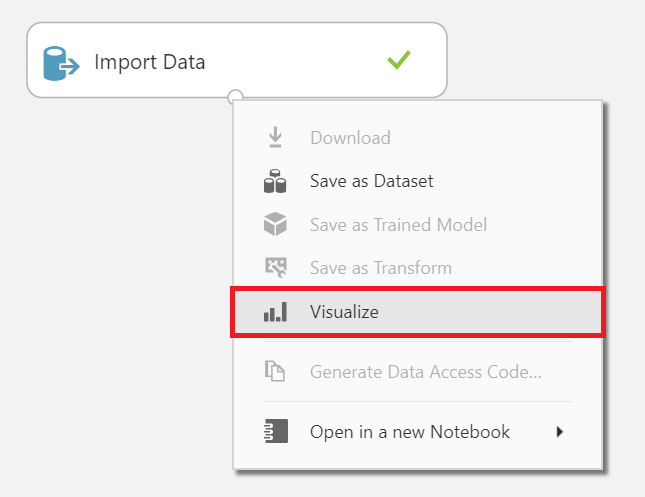

### 3.4. Split data

__Search__ _split Data_ from the left search box and __drag and drop__ the import module to canvas

And __drag__ _bottom port of Import Data module_ __drop__ to _top port of Split Data module_ to link between thoes two module

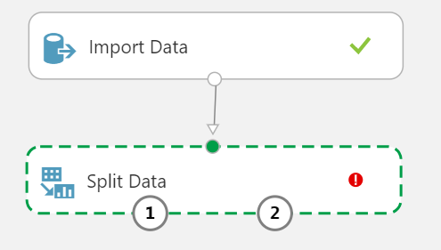

Update split ratio in the properites

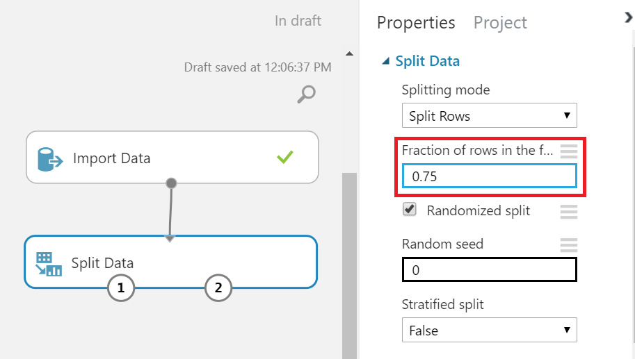

### 3.5. Train

To trian the model we'll use:
* Two-Calss Logistic Regression
* Two-Class Boosted Decision Tree

And the label is 'Churn' since we are trying to build a machine learning to predict a customer  churn

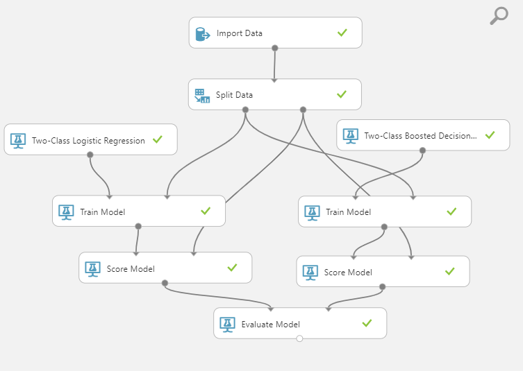

---
[Next > 04. Operationalization](https://github.com/xlegend1024/az-cloudscale-adv-analytics/blob/master/04Operationalization.md)

---
[Main](https://github.com/xlegend1024/az-cloudscale-adv-analytics/blob/master/README.md)
