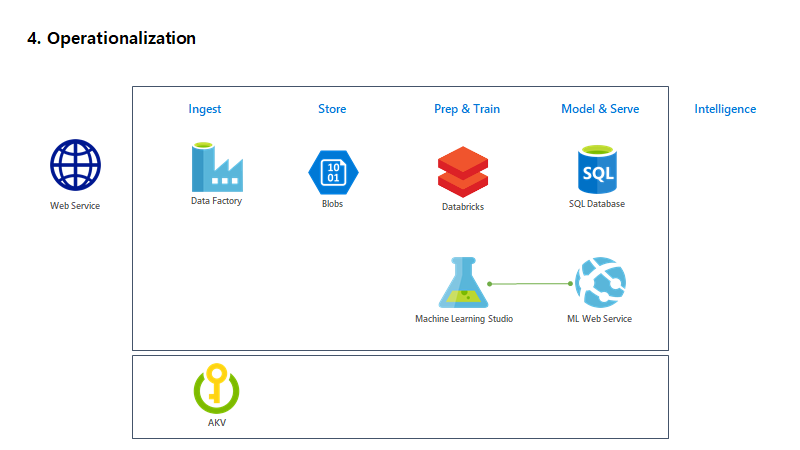
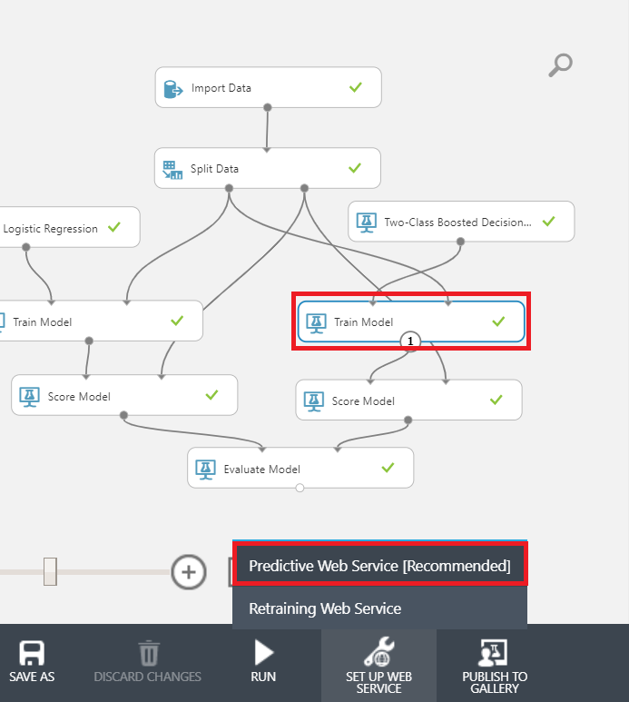
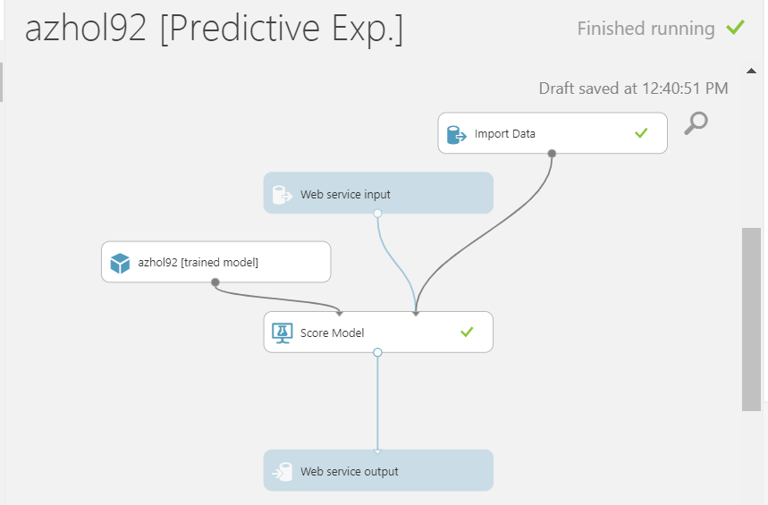
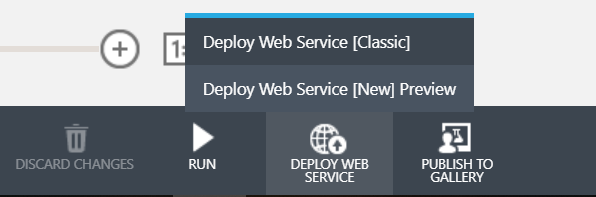
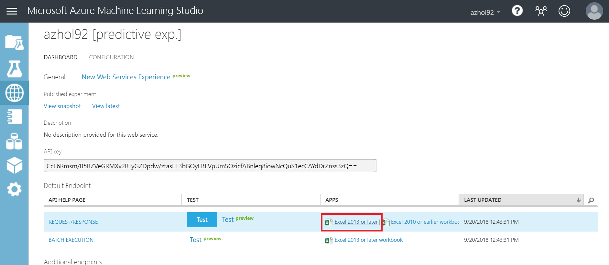
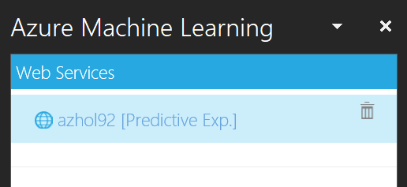

# 04. Operationalization

## Architecture

When you conduct multple experiments, you will find the most appropreate model for your buiness. And after the model selection, you need to make the score model as a service to use for your business. In this lab, we'll create a web service to expose your score model.

* Deploy a Web Service 

## 0. Access to AZ ML Studio

Open a new browser or tap and go to [Azure ML Studio](https://studio.azureml.net)

## 1. Select Model

Based on the result, __click__ on a model you want to use for operation, and then __click__ _'Predictive Web Service [Recommended]'_ to be ready to operationalize your model

When Predictive Experiment is ready, click on 'Run' to make model ready

When running is done your screen will look like following

Delete connection between _'Import Data'_ module and _'Score Model'_ module

__Add__ _'Select Columns in Dataset'_ module to canvas and __click__ _'Lanch column selector'_ to filter a column

__Click__ _'WITH RULES'_ and choose _'ALL COLUMNS'_, _'Exclude'_ and type _'churn'_

'Run' the experiment

## 2. Create and deploy web service

Click 'Deploy Web Service [Classic]' to deploy a service

> Note: Make sure your exepriment ran correctly and it's status shown as _Finished running_ on the top right conner

## 3. Download a sample excel and test

When deployment is done, you can download sample excel file to test your web service

To test your service, download one of excel file to your local machine

Open the downloaded excel file and click on 'enable' button to run excel add-in

Select your machine leaning model, it'll look like following

---
[Next > 05. Run Azure ML in Batch](https://github.com/xlegend1024/az-cloudscale-adv-analytics/blob/master/05RunMLBatch.md)

---
[Main](https://github.com/xlegend1024/az-cloudscale-adv-analytics/blob/master/README.md)
