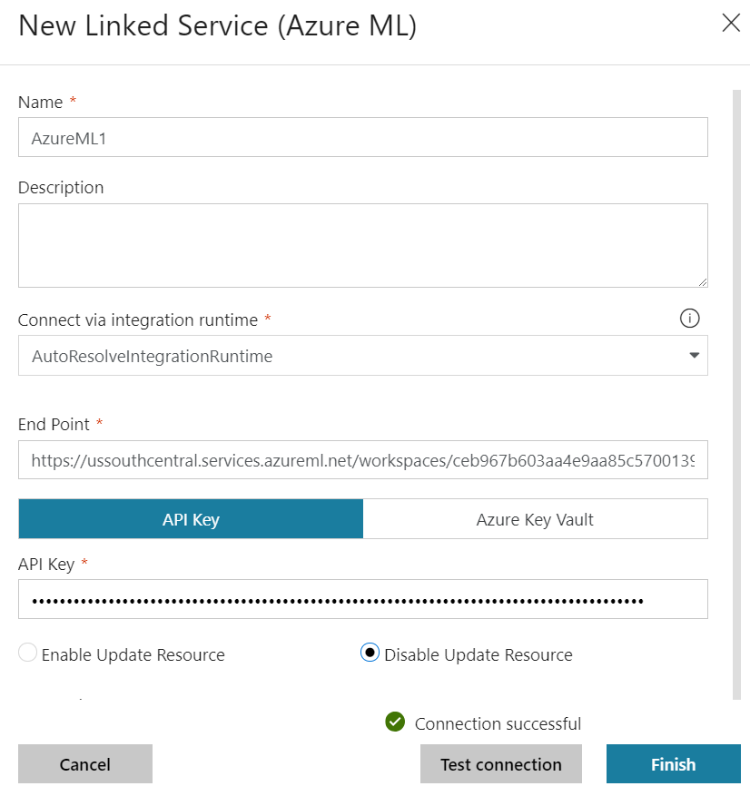
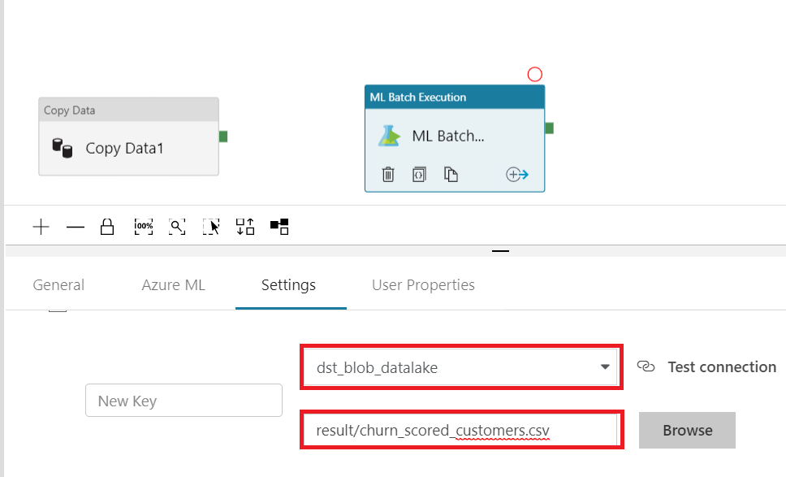

# 05. Run Azure ML in Batch

## Architecture

## 0. Access to Azure Portal

Go to [Azure Portal](https://azure.portal.com) for lab.

## 1. Open ADF 'Author & Monitor'

Fine your exsiting ADF and open 'Author & Monitor' tool

## 2.1. Create Connection for SQL DB

Create connection for two different services:
* SQL DB
* Azure Key Vault

Create new pipeline by clicking '+' and 'Pipeline'


__Drag and drop__ 'Copy Data' module fomr the activity panel to canvas

__Select__ 'Source' tab from the module and then __click__ _'+ New'_ to create new _'Linked Servcie'_

Search 'azure sql' from the New Linked Service window and select it and then click 'Finish' 


Since there is no database connection string information in your ADF, you need to give the connection string to ADF which is in your Azure Key Vault

Click _'Azure Key Vault'_ and then create '+ New' linked service for Azure Key Vault


In order to make ADF access to Azure Key Vault you need to copy the 'Service identity application ID' to Azure Key Vault

Copy your application ID and click linke 'Grant data.... Vault' it will take you to Azure Key Vault in Azure Portal


Select 'Secret Management'

Paste the application ID into search box and select application name and then click select at the bottom, click ok to continue. After the seeting make sure you save changed configuration.


Let's go back to ADF authoring tool and continut the configuration


## 2.2. Create SQL DB Table dataset

Create a new dataset for sql db table which has customer information in SQL Database

Drag and drop 'Copy Data' module form the left panel

__Select__ _'Source'_ tab and __select__ 'tblcustomer' srouce dataset

__Select__ _'Query'_ and __copy__ below sql query and paste it to query window

```sql
SELECT 
age,
annualincome,
calldroprate,
callfailurerate, 
callingnum,
customerid,
customersuspended,
gender,
homeowner,
maritalstatus,
monthlybilledamount,
numberofcomplaints,
numberofmonthunpaid,
numdayscontractequipmentplanexpiring,
occupation,
penaltytoswitch,
[state],
totalminsusedinlastmonth,  
unpaidbalance, 
usesinternetservice, 
usesvoiceservice,
percentagecalloutsidenetwork,
totalcallduration, 
avgcallduration
FROM tblCustomers
```


## 2.3. Create SQL DB Table dataset

__Click__ _'Sink'_ tab and __click__ '+ new' to __create__ a new destination dataset to save data from sql db

__Search__ _'blob'_ and __click__ _'finish'_


Name the blob dataset as 'customer_stg', click 'connection' tab and select 'dst_blob_datalake' and then __type__ _stage_ for container and _sqldb_tblcustomers.csv_ for file name
customer_stg








---
[Next > 99. Clean Up](https://github.com/xlegend1024/az-cloudscale-adv-analytics/blob/master/99Cleanup.md)

---
[Main](https://github.com/xlegend1024/az-cloudscale-adv-analytics/blob/master/README.md)
