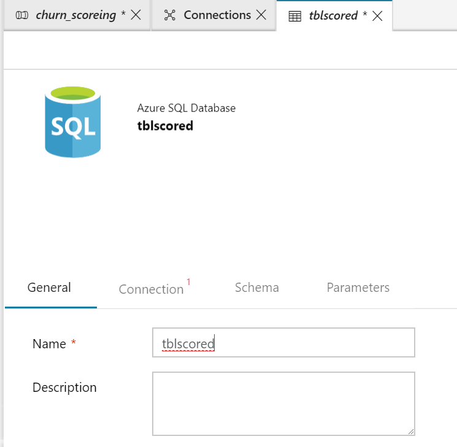

# 05. Run Azure ML in Batch

## Architecture

## 0. Access to Azure Portal

Go to [Azure Portal](https://azure.portal.com) for lab.

## 1. Open ADF 'Author & Monitor'

## 2. Create Connection





## 3. Create Dataset


```sql
SELECT 
age,
annualincome,
calldroprate,
callfailurerate, 
callingnum,
customerid,
customersuspended,
gender,
homeowner,
maritalstatus,
monthlybilledamount,
numberofcomplaints,
numberofmonthunpaid,
numdayscontractequipmentplanexpiring,
occupation,
penaltytoswitch,
[state],
totalminsusedinlastmonth,  
unpaidbalance, 
usesinternetservice, 
usesvoiceservice,
percentagecalloutsidenetwork,
totalcallduration, 
avgcallduration
FROM tblCustomers
```


customer_stg

stage/sqldb_tblcustomers.csv


---
[Next > 99. Clean Up](https://github.com/xlegend1024/az-cloudscale-adv-analytics/blob/master/99Cleanup.md)

---
[Main](https://github.com/xlegend1024/az-cloudscale-adv-analytics/blob/master/README.md)
