# 05. Run Azure ML in Batch

## Architecture

Now you deployed your score model as a web service. You can build your custom application that consum the score model. In this lab, you will export new customer data from SQL DB and use your score model to predict your customer churn.

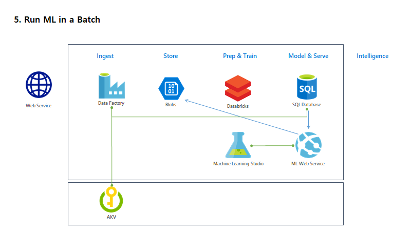

## 0. Access to Azure Portal

Go to [Azure Portal](https://azure.portal.com) for lab.

## 1. Open ADF 'Author & Monitor'

Fine your exsiting ADF and open 'Author & Monitor' tool

## 2.1. Create Connection for SQL DB

Create connection for two different services:
* SQL DB
* Azure Key Vault

Create new pipeline by clicking '+' and 'Pipeline'

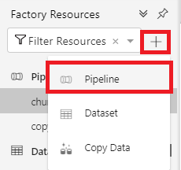

__Drag and drop__ 'Copy Data' module fomr the activity panel to canvas

__Select__ 'Source' tab from the module and then __click__ _'+ New'_ to create new _'Linked Servcie'_

Search 'azure sql' from the New Linked Service window and select it and then click 'Finish' 

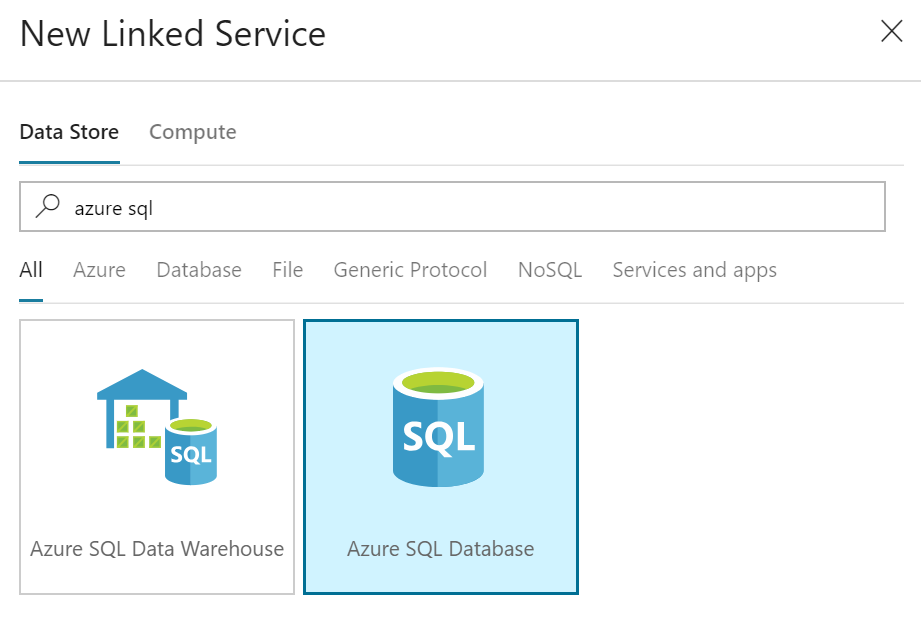

Since there is no database connection string information in your ADF, you need to give the connection string to ADF which is in your Azure Key Vault

Click _'Azure Key Vault'_ and then create '+ New' linked service for Azure Key Vault

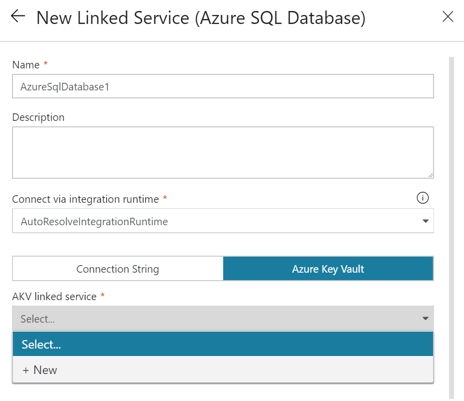

In order to make ADF access to Azure Key Vault you need to copy the 'Service identity application ID' to Azure Key Vault

Copy your application ID and click linke 'Grant data.... Vault' it will take you to Azure Key Vault in Azure Portal

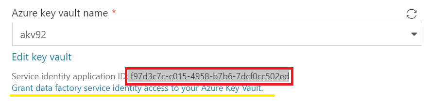

Select 'Secret Management'

Paste the application ID into search box and select application name and then click select at the bottom, click ok to continue. After the seeting make sure you save changed configuration.

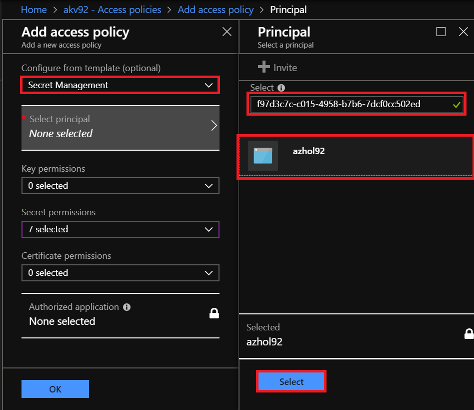

Let's go back to ADF authoring tool and continut the configuration

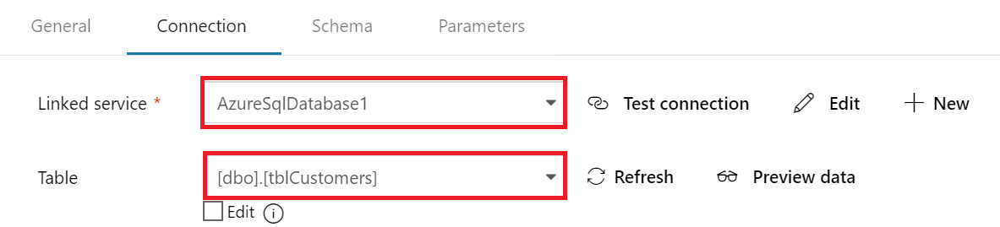

## 2.2. Create SQL DB Table dataset

Create a new Azure Data Factory dataset for sql db table that has customer information in SQL Database

__Drag and drop__ 'Copy Data' module form the left panel

__Select__ _'Source'_ tab and __select__ 'tblcustomer' srouce dataset

__Select__ _'Query'_ and __copy__ below sql query and paste it to query window

```sql
SELECT 
age,
annualincome,
calldroprate,
callfailurerate, 
callingnum,
customerid,
customersuspended,
gender,
homeowner,
maritalstatus,
monthlybilledamount,
numberofcomplaints,
numberofmonthunpaid,
numdayscontractequipmentplanexpiring,
occupation,
penaltytoswitch,
[state],
totalminsusedinlastmonth,  
unpaidbalance, 
usesinternetservice, 
usesvoiceservice,
percentagecalloutsidenetwork,
totalcallduration, 
avgcallduration
FROM tblCustomers
```

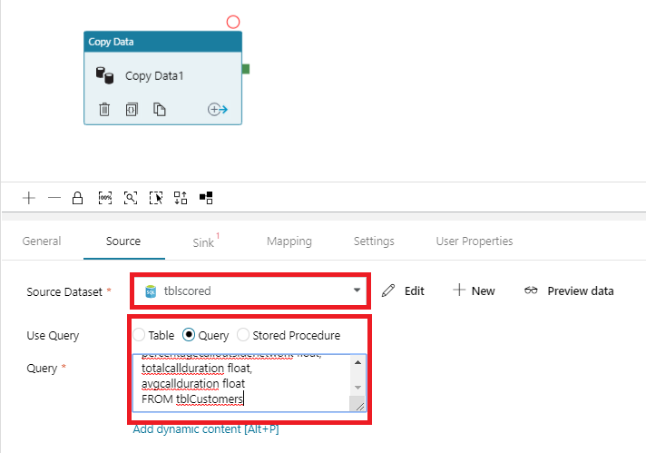

## 2.3. Create Blob CSV dataset

__Click__ _'Sink'_ tab and __click__ '+ new' to __create__ a new destination dataset to save data in Azure blob

__Search__ _'blob'_ and __click__ _'finish'_


Name the blob dataset as 'customer_stg', click 'connection' tab and select 'dst_blob_datalake' which is existing and then __type__ _stage_ for container and _sqldb_tblcustomers.csv_ for the file name

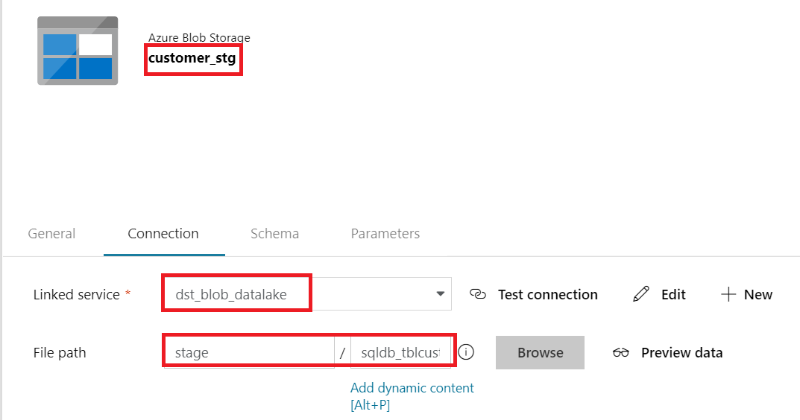

## 2.4. Create Azure ML Connection

Next step is ML Batch Execution activity

__Drag and Drop__ _'ML Batch Execution Activity'_ module to canvas


Click 'Azure ML' tab of the _'ML Batch Execution Activity'_ module and click _'+ New'_ to create new _'AML linked service'_

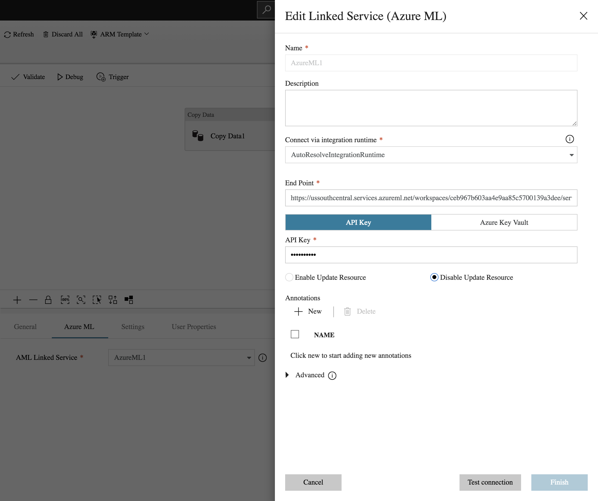

You need Azure ML web service endpoint and API Key to access to it. You can get both web service endpint and API Key from [Azure ML Studio Web Service Management page](https://studio.azureml.net/)

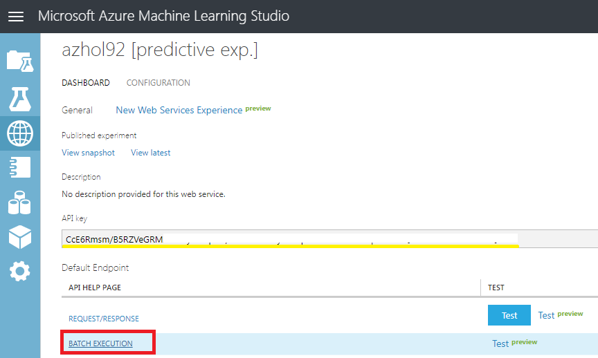

When you click on '_BATCH EXECUTION_' in the API HELP PAGE, you can find API URL

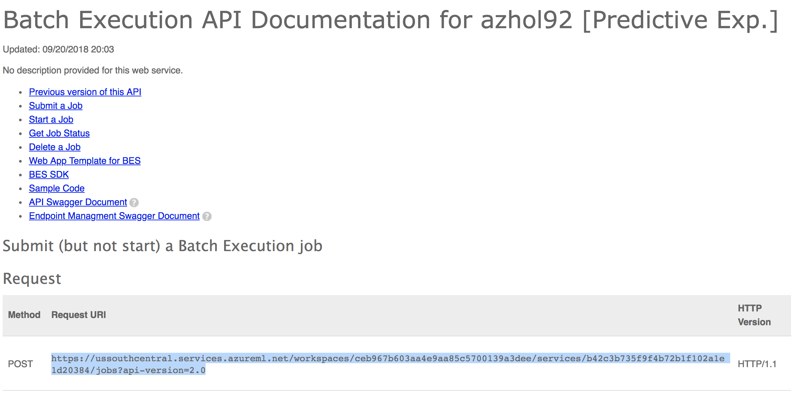

When you filled out the endpoint and API key, go to '_Setting_' tab of _ML Batch Execution module_

Type input key name, input storage linked service and path of the file

|Input Key Name|Linked Service|Path|
|---|---|---|
|input1|dst_blob_datalake|stage/sqldb_tblcustomers.csv|

And also type output key name, output storage linked service and path where the result file will be stored after the scoreing

|Ouput Key Name|Linked Service|Path|
|---|---|---|
|input1|dst_blob_datalake|result/churncustomers.csv|

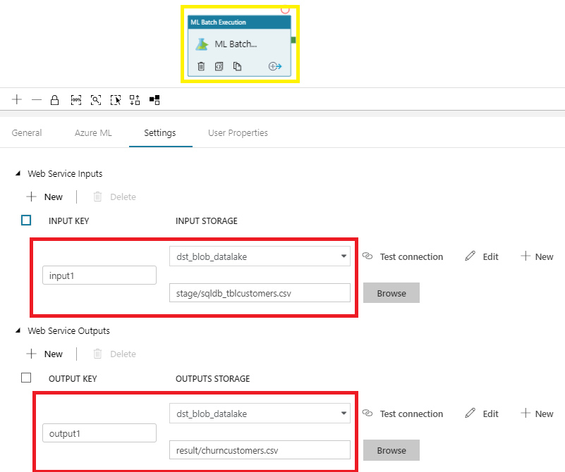

Create connection by drag the output from Copy Data module drop to ML Batch Execution moudle

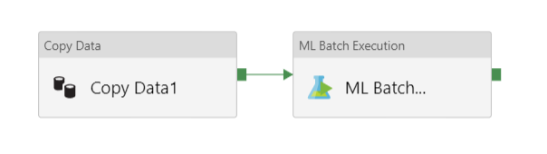

Lastly start the job, by triggering pipeline and then go to your blob storage to see the result of ML Batch Execution

---
[Next > 99. Clean Up](https://github.com/xlegend1024/az-cloudscale-adv-analytics/blob/master/99Cleanup.md)

---
[Main](https://github.com/xlegend1024/az-cloudscale-adv-analytics/blob/master/README.md)
