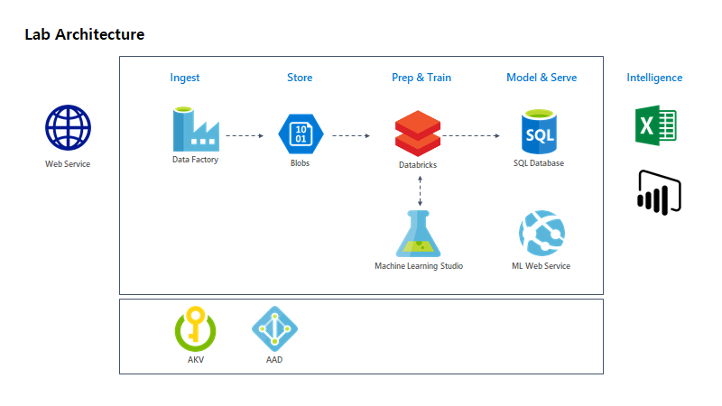

# Cloud Scale Advanced Analtyics

Experience end-to-end Advanced Analytics on cloud using Blob, ADF, Databricks, SQLDB and Azure Machine Leaning Studio.

In this hands on lab, you can understand how to apply following Azure services to your project

* Azure Data Factory
* Azure Databricks
* Azure SQL Database
* Azure Key Vault

After the workshop you will be able to:

1. Understand process and architecture for cloud scale andvanced analaytics project
1. Create appropreate Azure services for data prep. & training environment
1. Know how to wanggle data in a scale
1. Expermiments on data and select the best model
1. Deploy and interact with your score model

## Architecture

## Scenario

Extract data from a web and load the data to Azure Blob storage. Mount the Azure Blob storage to Azure Databricks to prepare the data for Machine Learning. When save prepared data on Azure Blob, access the prepared data from Azure Machine Learning Studio. Conduct machine learning experiments and select the best model for prediction. When a model is selected, deploy the score model as a web service from the Azure Machine Learning Studio. Lastly, extract new data set from SQL Database and 

### [Lab 00. Create hands on lab environment](https://github.com/xlegend1024/az-cloudscale-adv-analytics/blob/master/00.SetupEnv.md)

1. Create Hands-on Lab envrironment using a script

### [Lab 01. Ingest](https://github.com/xlegend1024/az-cloudscale-adv-analytics/blob/master/01Ingest.md)

1. Create Azure Data Factory (v2)

1. Create Data Pipeline

### [Lab 02. Data wrangling](https://github.com/xlegend1024/az-cloudscale-adv-analytics/blob/master/02DataWrangling.md)

1. Create Azure Databricks

1. Create Azure Databricks cluster

1. Import and Run Notebook

## Citizenship Data Scientist

### [Lab 03. Modeling](https://github.com/xlegend1024/az-cloudscale-adv-analytics/blob/master/03Modeling.md)

1. Create Azure Machine Learning Studio

1. Create workspace

### [Lab 04. Operationalize score model](https://github.com/xlegend1024/az-cloudscale-adv-analytics/blob/master/04Operationalization.md)

1. Create web service

1. Update inputs

1. Publish web service

1. Download a sample excel and test

### [Lab 05. Run](https://github.com/xlegend1024/az-cloudscale-adv-analytics/blob/master/05RunMLBatch.md)

1. Create a new pipeline for batch ml processing

---
[Start Lab > 01. Ingest Data](https://github.com/xlegend1024/az-cloudscale-adv-analytics/blob/master/01Ingest.md)

---

## Sources and references
* https://docs.microsoft.com/en-us/azure/machine-learning/studio/azure-ml-customer-churn-scenario
* https://github.com/Azure/MachineLearningSamples-ChurnPrediction 