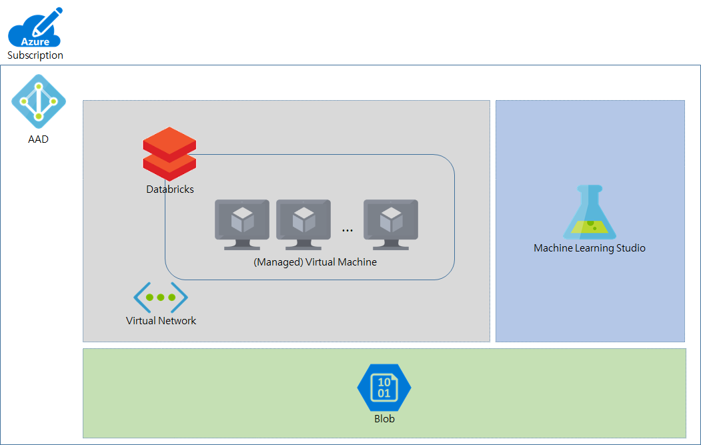

# Databricks Workshop

Experience Azure Databricks and Azure Machine Leaning Studio
Thu out this hands on lab Understand how to apply followings for you work:

* Databricks
* Azure ML Studio

After the workshop you will be able to:

1. Understand process and architecture
1. Create appropreate Azure services for data prep. & training environment
1. Know how to wanggle data in a scale
1. Expermiments on data and select  
1. Deploy and interact with score model

## Briefing

Overview and intro about Azure Data Services
	Focus on data preparation and machine learning experiments 
	demo
		* Databricks and ML Studio

## Hands on lab
Architecture and scenario

### Architecture

### Scenario 

	
	
		
